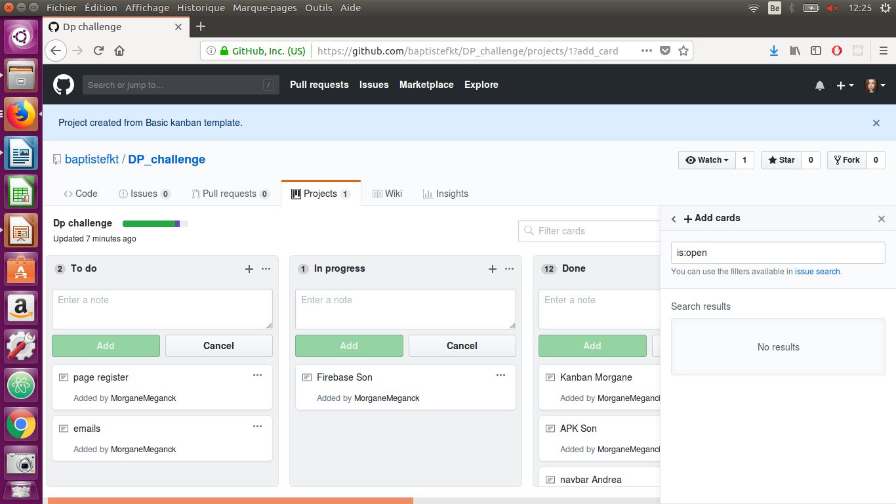
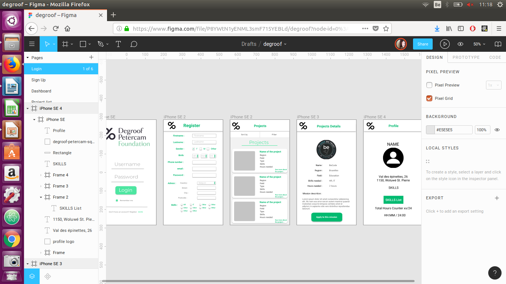
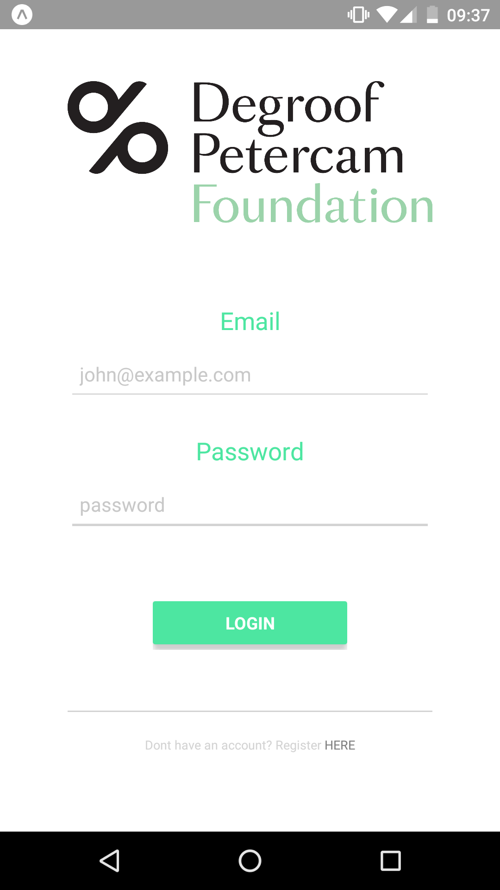
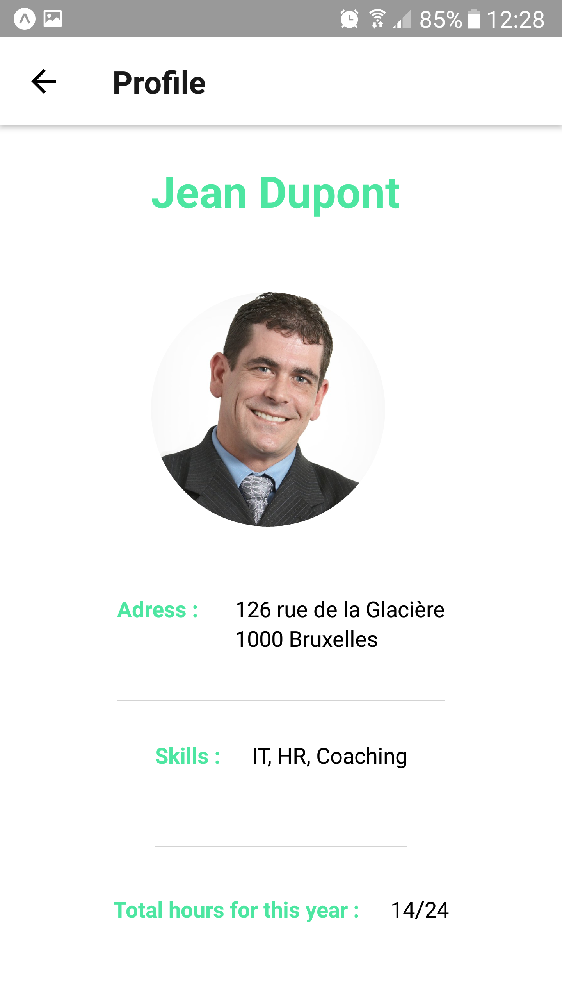
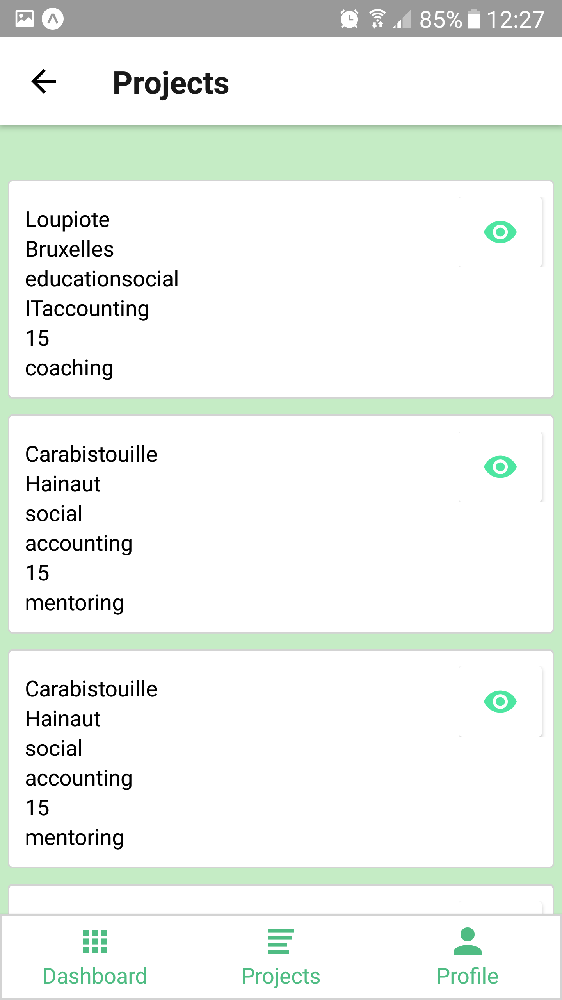
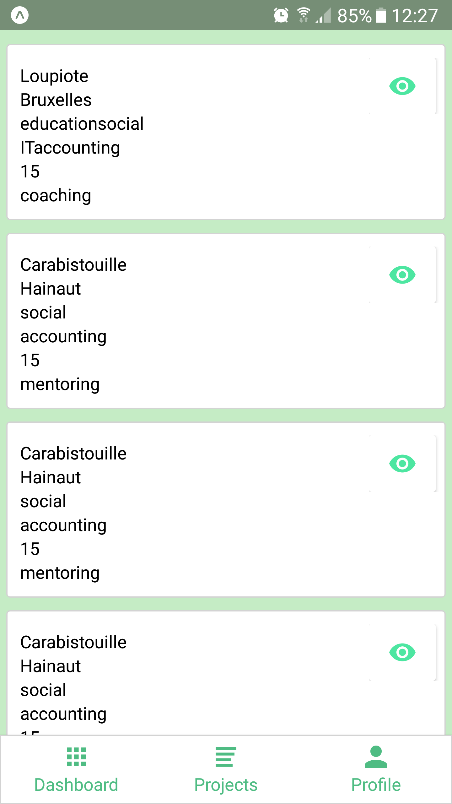
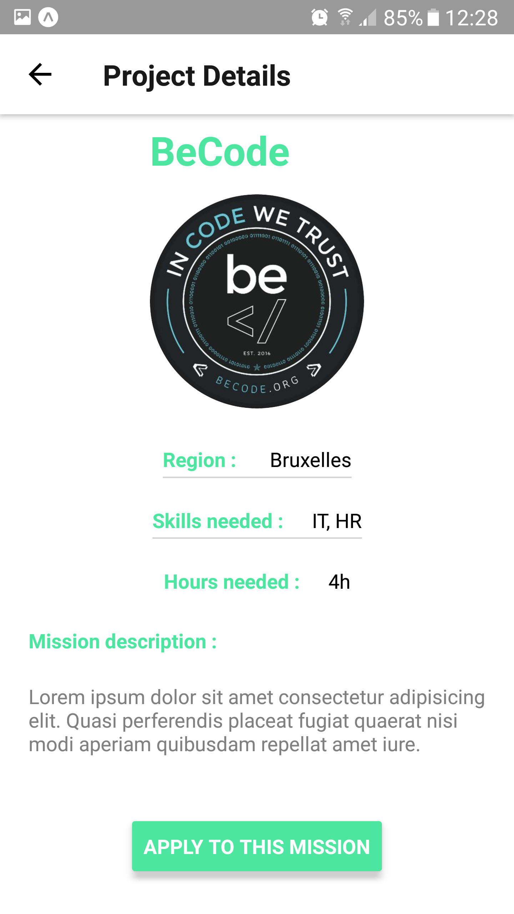

# Degroof Petercam

# Application Mobile 

Analyser, concevoir et développer une application mobile pour Androïd.

## Equipe

Formation **Becode.org**  (Start-up Lovelace2)
* Quang Son Lee
* Andrea Pinna Picone
* Baptiste Firket
* Morgane Meganck

## Projet

* Réalisation sous React Native 
* Durée: 3 jours ouvrables (Début: 24/09/2018 - Fin: 26/09/2018)

## Consignes 

* 
* Charte Graphique fourni par l'équipe de Degroof Petercam
* 

## Déroulement

1. Agile (manipulation tableau kanban) + tenue quotidienne du planning du groupe.
  
2. Désignation du capitaine du repo, qui gère les merge et les conflits (Quang Son Lee)
3. Réalisation d'un Mockup avec Figma 
4. Backend: Tentative d'utilisation d'une base de données via Firebase -> Création en dure pour pouvoir continuer
5. Utilisation de Git pour le versioning et utilisation de branches
6. Rédaction d'un Readme

## Screenshots

* 
* 
* 
* 
* 

